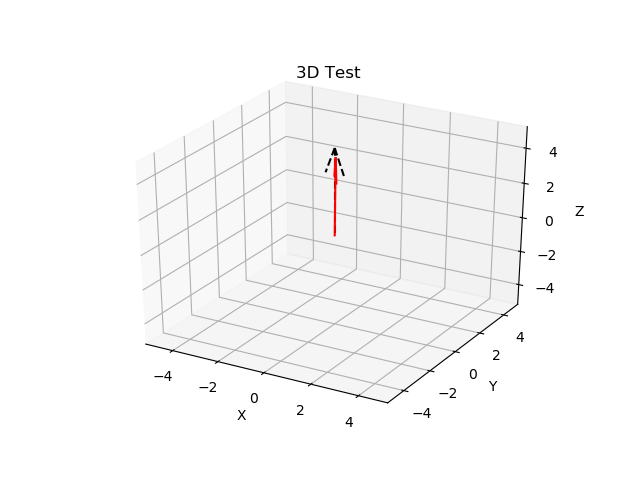

# MRI Report for Programming Task 2
## By:
* Ghada Adel Abdelaziz
* Toaa Mahmoud AbdelHakim
* Neveen Fathy
* Mostafa Tawfiq
## Introduction
```c
My team and I have written codes of whole parts of this task in python by using jupyter notepook of Anaconda3.

we implemented the required point with another method separately from that we used in task 1.
```
## implementation & describtion
* ## K-space 
```c
k-space is an array of numbers representing spatial frequencies in the MR image.
The common pictorial representation of k-space as a "galaxy" perpetuates the mystery. Each "star" in k-space is just a data point derived directly from the MR signal. The brightness of each star represents the relative contribution of that star's unique spatial frequency to the final image.

```
```python
import cv2
import numpy as np
import matplotlib
from matplotlib import pyplot as plt
from numpy.fft import fftshift, ifftshift, fftn, ifftn
```


```python
matplotlib.rcParams['font.size'] = 8.0
np.random.seed(19680801)

img = cv2.imread('C:\\Users\\Ghada\\Downloads\\Brain-MRI.png', 0)
dim = range(img.ndim)

k = fftshift(fftn(ifftshift(img, axes=dim), s=None, axes=dim), axes=dim)
k /= np.sqrt(np.prod(np.take(img.shape, dim)))
k = np.real(k)
magnitude_spectrum = 20 * np.log(np.abs(k) + 1)

images = []

fig, axs = plt.subplots(1, 2)

for j in range(2):
    axs[j].set_yticklabels([])
    axs[j].set_xticklabels([])

data = [img, magnitude_spectrum]

images.append(axs[0].imshow(data[0], cmap='gray'))
axs[0].set_title('Input Image')

images.append(axs[1].imshow(data[1], cmap='gray'))
axs[1].set_title('K-space')

plt.show()
```


)

* ## Larmor frequency
```c
WThe frequency of this spinning is the precessional / Larmor / rotational frequency. 
In MR imaging we induce precession by applying a magnetic field 
(conventionally in the Z axis and called B0, along the long axis of the patient). 
This magnetic field is permanently switched on in the MRI scanner.

larmor_frequency = gyromagnetic_ratio * magnetic_field where, gyromagnetic_ratio = 42.58MHz/T

The precessional frequency is calculated by the **Larmor Equation:**
```
```c
The first plot in this part represents the effect of External non uniform electromagnetic-field (EMF) along the whole body (which is represented by X _axis), (Y _axis) represents the range of values of EMF (from 1 :  Tesla) through different points through body due to the non-uniformity effect of External EMF, so not all points along the whole body must have the same effect of External EMF which is represented by upper plot.
```

```c
The second plot in this part represents the effect of External EMF on water molecules through the whole body( X _axis), (Y _axis) represents the multiplication of gyromagnetic ratio of both hydrogen & oxygen protons what the water molecules contain by External EMF ( 1000m T : 1500 m T), this plot shows that the non-uniformity effect of External EMF on water molecules through human’s body.
```

```c
we sepatare the water molecule to its ptotons; hydrogen & oxygen; 

where :

gyromagnetic_ratio of hydrogen = 42.58 &
gyromagnetic_ratio of oxygen = 5.8

```
```python
import random
import numpy as np
import matplotlib.pyplot as plt
```


```python
Mag_Field = np.random.randint(low= 1 , high= 100, size = 15)
print (Mag_Field)
```

    [21 85 61  7 35 35 24 68 50 37 19 76 73 38 12]
    


```python
larmorFreq_Hydrogen =42.58*Mag_Field
print(larmorFreq_Hydrogen)
```

    [ 894.18 3619.3  2597.38  298.06 1490.3  1490.3  1021.92 2895.44 2129.
     1575.46  809.02 3236.08 3108.34 1618.04  510.96]
    


```python
larmorFreq_Oxygen = 5.8*Mag_Field
print(larmorFreq_Oxygen)
```

    [121.8 493.  353.8  40.6 203.  203.  139.2 394.4 290.  214.6 110.2 440.8
     423.4 220.4  69.6]
    


```python
fig1 = plt.figure(2)
ax1 = plt.axes(xlim=(0,150 ), ylim=(1, 100))
line1, = ax1.plot([], [], lw=2)
ax1.set_xlabel("time")
ax1.set_ylabel("Mag_Field")
xline = np.arange(0, 150, 1)
yline = []
for d in range(len(xline)):
    yline.append(random.randint(1,100))
    
ax1.plot(xline, yline, 'red')
```


    [<matplotlib.lines.Line2D at 0x1c320783a88>]


```python
fig = plt.figure(2)
ax = plt.axes(xlim=(0,150 ), ylim=(50, 5000))
line, = ax.plot([], [], lw=2)
ax.set_xlabel("time")
ax.set_ylabel("Larmor_Freq")
xline = np.arange(0, 150, 1)
yline = []
yline1 = []
for d in range(len(xline)):
    larmorFreq_Hydrogen = 42.58*random.randint(1,100)
    larmorFreq_Oxygen = 5.8*random.randint(1,100)
    yline.append(larmorFreq_Hydrogen)
    yline1.append(larmorFreq_Oxygen)
    
ax.plot(xline, yline, 'pink')
ax.plot(xline, yline1, 'blue')
```


    [<matplotlib.lines.Line2D at 0x1c320875ec8>]


* ## Bulk magnetization’s trajectory

```c
we made random magnetic field manually in python file where the magnetic field increased rapidly till the trajectory reach the Z-axis.

```
```python
import numpy as np
from mpl_toolkits.mplot3d import Axes3D
import matplotlib.pyplot as plt
import matplotlib.animation as animation
import math


# function to create the rotation matrix
def rotMatrix(angle):
    c = np.cos(np.radians(angle))
    s = np.sin(np.radians(angle))
    return np.array([[c, -s], [s, c]])


flag = 0
random = []  # a list to store the nonuniform magnetic field


def data_gen(num):
    """Data generation"""

    global flag
    global random
    if num == 90 and flag == 0:
        flag = 1
    elif num == 180 and flag == 1:
        flag = 0

    z = num / 18

    if flag == 0 and not z == 10:
        ax.cla()
        ax.quiver(0, 0, 0, z, 0, (5 - z), pivot="tail", color="red")

    elif flag == 1 and not z == 10:
        z = z - 5
        v = np.array([0, (5 - z)])

        random = np.random.randint(1, 100, 90)
        v30 = rotMatrix(num * (random[num-90])).dot(v)
        ax.cla()
        ax.quiver(0, 0, 0, v30[0], v30[1], z, pivot="tail", color="red")

    ax.quiver(0, 0, 0, 0, 0, 5, pivot="tail", color="black",
              linestyle="dashed")

    ax.set_xlim3d([-5, 5])
    ax.set_xlabel('X')

    ax.set_ylim3d([-5, 5])
    ax.set_ylabel('Y')

    ax.set_zlim3d([-5, 5])
    ax.set_zlabel('Z')

    ax.set_title('3D Test')


gyromag_ratio = 42.6  # gyromagnetic ratio for the Hydrogen atoms
r = np.random.randint(1, 100, 90)
print(r * gyromag_ratio)  # List of different angular frequencies in MHz

fig = plt.figure()
ax = fig.add_subplot(111, projection='3d')
data_gen(0)
ani = animation.FuncAnimation(fig, data_gen, 181, interval=1, blit=False)
# ani.save('animated_gif1.gif', writer=animation.PillowWriter(fps=30))
plt.show()
```

    [2896.8 2982.  2087.4 2556.  3152.4  170.4 2172.6 1448.4 4132.2 2428.2
     4089.6   42.6 2726.4 3876.6   42.6  766.8 1022.4 1107.6 1065.  3024.6
     2598.6 1022.4 2428.2  852.  2598.6 4217.4 3195.  1831.8 3237.6 2044.8
     3152.4  170.4 3791.4 1661.4 1831.8  468.6 1533.6 3067.2 4047.  2215.2
     4004.4 3748.8 3450.6 3834.  4174.8  255.6  298.2 1448.4 1065.  1363.2
      383.4  127.8 4132.2 1235.4 2130.  2811.6 2982.  1065.  2470.8 2683.8
     3195.    42.6 2726.4 1065.  3280.2  255.6 3876.6  894.6 2257.8 1107.6
     1022.4  340.8  809.4 2726.4   42.6 2683.8 2769.  2428.2  255.6  809.4
     3493.2 3578.4 3493.2 2769.  1533.6  426.  3280.2 1618.8 2811.6 1576.2]
    



